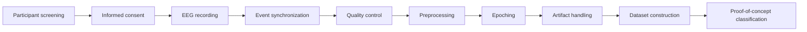

# Hindi Imagined-Speech EEG Dataset

**Project:** A Hindi Imagined-Speech Dataset for Thought-to-Text and Mental Health Applications  
**Status:** Protocol-aligned preparation for data collection

---

## Overview

This repository supports the development of a Hindi EEG imagined-speech dataset. The study records EEG while healthy adult Hindi-speaking participants **silently imagine speaking displayed Hindi words**. Participants do not speak, whisper, lip-sync, or intentionally move the lips or tongue during the imagined-speech window.

The study is designed to create a structured research dataset for Hindi imagined-speech / inner-speech BCI research and to support proof-of-concept classification of imagined-word conditions and rest. The dataset is **not a diagnostic or mental-state-reading system** and should not be interpreted as evidence about a participant's mental-health state.

## Current Protocol Specification

The repository is aligned to the current study protocol supplied by the research supervisor. Where the protocol still identifies an item as requiring confirmation, this repository preserves that uncertainty rather than inventing a final value.

### Participants

- Healthy adult Hindi-speaking volunteers
- Target sample: **10 participants**
- Age range specified in the current committee protocol: **18–35 years**
- Screening and consent are completed before EEG recording
- Participant identifiers are coded; directly identifying information is not stored in the research dataset

### Imagined-Speech Task

Participants view a Hindi word and silently imagine saying it. The task is covert speech: no overt vocalization or intentional articulatory movement is required.

The current protocol specifies **6 Hindi word classes/stimuli** for the recording task.

### Trial Timing

The current trial sequence is:

```text
500 ms fixation
        ↓
300 ms Hindi word display
        ↓
3000 ms imagined speech
        ↓
1000 ms rest/reset
        ↓
next trial
```

These timings should be implemented consistently by the stimulus-presentation system and verified during pilot testing.

### Recording Structure

| Stage | Trials | Approx. duration |
|---|---:|---:|
| Practice | 55 | ~4 min |
| Main Block 1 | 110 | ~8.8 min |
| Main Block 2 | 110 | ~8.8 min |
| Main Block 3 | 110 | ~8.8 min |
| Main Block 4 | 110 | ~8.8 min |

The exact session/break arrangement should follow the final supervisor-approved implementation.

## Participant Documents

The repository now includes protocol-aligned participant-facing and operational documents:

| File | Purpose |
|---|---|
| [`participant_information_sheet.md`](participant_information_sheet.md) | Plain-language explanation of the study, procedure, risks, benefits, privacy, withdrawal, and future data use |
| [`informed_consent_form.md`](informed_consent_form.md) | Written informed consent and optional future-use/public-sharing consent |
| [`participant_invitation_email.md`](participant_invitation_email.md) | Recruitment/invitation email template |
| [`participant_screening_form.md`](participant_screening_form.md) | Eligibility and safety screening template |
| [`participant_instructions.md`](participant_instructions.md) | Instructions given to participants before/during the imagined-speech task |
| [`eeg_session_checklist.md`](eeg_session_checklist.md) | Research-team checklist for setup, recording, QC, and data handling |

These are **templates for the study team** and should be finalized against the latest ethics-approved versions before being used with participants.

## EEG Hardware

The current protocol identifies the EEG hardware as an item requiring confirmation between the proposed systems (including OpenBCI Cyton+Daisy / Emotiv EPOC+). Therefore:

- **Do not assume a final device in preprocessing code yet.**
- Channel count, montage, sampling rate, reference and ground must be recorded from the actual device used.
- The electrode description must be kept consistent with the final hardware and protocol.

Once the hardware is confirmed, the preprocessing parameters and acquisition metadata should be updated accordingly.

## Event Timeline and Markers

The recording system should produce synchronized event markers for the trial stages. The repository uses the following conceptual events:

| Marker | Meaning |
|---|---|
| `REST_ON` | Rest/reset begins |
| `CUE_ON` | Hindi word appears |
| `IMAGINE_ON` | 3-second imagined-speech window begins |
| `IMAGINE_OFF` | Imagined-speech window ends |
| `TRIAL_END` | Trial is complete |

Marker timing must be synchronized with the EEG recording stream or otherwise validated for latency/jitter. See [`docs/event_marker_protocol.md`](docs/event_marker_protocol.md).

## Research Pipeline



## Dataset Organization

The intended data organization is participant/session based and keeps raw and processed EEG separate:

```text
data/
├── raw/
│   └── sub-P001/
│       └── ses-S001/
│           ├── eeg/
│           └── events/
└── processed/
    └── sub-P001/
        └── ses-S001/
```

Example naming:

```text
sub-P001_ses-S001_task-imaginedspeech_eeg.<native-format>
sub-P001_ses-S001_task-imaginedspeech_events.tsv
```

No real participant EEG data should be committed to GitHub unless release, consent, institutional policy, and repository handling have been explicitly approved.

## Metadata

Two core metadata layers are maintained:

- `metadata/participant_metadata.csv` — coded participant-level information needed for study interpretation and quality control.
- `metadata/trial_metadata.csv` — one row per trial containing participant/session identifiers, class/stimulus information, event timing, and QC fields.

The metadata schema must remain consistent with the actual recording software and raw EEG event stream.

## Preprocessing

The preprocessing workflow is designed for the actual study data and should include, as applicable after hardware confirmation:

1. Verify raw recording integrity.
2. Verify channel count and sampling rate.
3. Verify event-marker count/order/timing.
4. Identify bad channels and recording-quality problems.
5. Apply the approved EEG filtering and re-referencing strategy.
6. Identify ocular/cardiac and other artifacts.
7. Apply the approved artifact-removal/rejection procedure.
8. Epoch trials using the synchronized imagination marker.
9. Perform baseline/QC checks according to the finalized protocol.
10. Record every preprocessing decision in the preprocessing log.

**Filter cutoffs, epoch windows, rejection thresholds, and device-specific settings must not be treated as final until hardware/pilot validation and supervisor approval are complete.**

See [`preprocessing/preprocessing_pipeline.md`](preprocessing/preprocessing_pipeline.md).

## Quality Control

Before a participant/session is accepted into the processed dataset, check:

- Expected recording duration
- Channel count and sampling rate
- Missing or corrupted EEG segments
- Marker count and order
- Marker-to-EEG timing
- Excessive noise or bad channels
- Eye/muscle artifacts
- Trial-level rejection flags
- Consistency between raw events and `trial_metadata.csv`

Every exclusion or modification should be documented rather than silently removed.

## Vocabulary

The final recording task uses **6 Hindi word classes/stimuli** according to the current protocol. Vocabulary files in this repository should therefore be treated as protocol-controlled stimuli rather than an independently expanding candidate list.

The rationale for the final words, linguistic balancing, and supervisor-approved list should be documented in [`docs/vocabulary_rationale.md`](docs/vocabulary_rationale.md).

## Ethics, Privacy and Data Governance

- Recording is performed only under the applicable institutional ethics approval and study procedure.
- Participation requires informed consent.
- EEG research data uses coded participant identifiers.
- Consent forms and directly identifying information are stored separately from the research dataset.
- Do not commit names, registration numbers, phone numbers, email addresses, signed consent forms, or other directly identifying information to GitHub.
- Any future data sharing must follow the approved consent, institutional policy, and applicable data-governance requirements.

## Important Status Rule

This repository distinguishes **protocol-defined facts** from **items still requiring confirmation**. Do not replace a pending item with an assumed value simply to make the documentation look complete.

### Confirmed/current protocol items

- 10 target participants
- 18–35 years in the current committee protocol
- 6 Hindi word classes/stimuli
- 500 ms fixation
- 300 ms word display
- 3000 ms imagined-speech window
- 1000 ms rest/reset
- 55-trial practice block
- Four 110-trial main blocks
- Silent imagined speech / no overt speaking

### Still requiring confirmation where applicable

- Final EEG hardware and exact channel configuration
- Final electrode montage description
- Device-specific sampling/reference/ground details
- Exact marker implementation and measured latency/jitter
- Any final protocol details explicitly marked for confirmation by the supervisor/ethics process

## Repository Structure

```text
hindi-imagined-speech-eeg/
├── README.md
├── LICENSE
├── CITATION.cff
├── CHANGELOG.md
├── participant_information_sheet.md
├── informed_consent_form.md
├── participant_invitation_email.md
├── participant_screening_form.md
├── participant_instructions.md
├── eeg_session_checklist.md
├── docs/
│   ├── experimental_protocol.md
│   ├── event_marker_protocol.md
│   ├── vocabulary_rationale.md
│   ├── vocabulary_validation.md
│   ├── literature_review.md
│   ├── data_dictionary.md
│   ├── ethical_considerations.md
│   ├── research_status.md
│   ├── decision_log.md
│   └── supervisor_approval_checklist.md
├── metadata/
│   ├── participant_metadata.csv
│   └── trial_metadata.csv
├── vocabulary/
├── preprocessing/
├── data/
│   ├── raw/
│   └── processed/
├── code/
│   ├── preprocessing/
│   ├── quality_control/
│   └── analysis/
└── results/
```

## Project Status

The repository is now being updated to the **current supervisor/ethics protocol**. Recorded EEG data, final device-specific preprocessing settings, and experimental results should only be added after the relevant recording and approval steps are complete.

## Citation

See [`CITATION.cff`](CITATION.cff) for project citation metadata.
