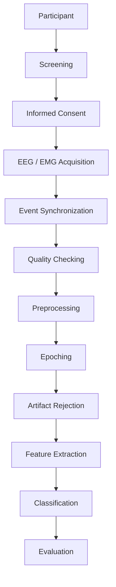

# Hindi Imagined-Speech EEG Dataset


---

## Overview

This repository documents the design and (eventual) collection of an EEG
dataset recorded while participants silently imagine speaking Hindi
words and phrases. The motivation is straightforward: almost no public
imagined-speech EEG data exists for Hindi, despite Hindi having several
hundred million speakers, and almost all existing work on this problem
is in English, Spanish, or Chinese. Without a dataset, no one — including
us — can begin to study whether Hindi imagined speech can be decoded
from EEG at all.

The longer-term motivation is assistive communication: people who lose
the ability to speak or move (for example, in advanced ALS or locked-in
syndrome) but retain normal cognition may eventually benefit from a
brain-signal-based communication channel. A well-documented dataset is
a prerequisite for any research in that direction, not a finished
solution to it.

This repository is a **work in progress**. It currently contains the
experimental protocol, candidate vocabulary, metadata schemas, and
supporting documentation used to plan data collection. It does **not**
yet contain recorded EEG data, trained models, or experimental results.

## Research Question

> Can EEG signals recorded while a participant silently imagines
> speaking a Hindi word or phrase contain reproducible, decodable
> information about the intended linguistic target?

This has **not** been demonstrated for this dataset. It is the question
this project is designed to investigate, following a body of prior work
in other languages that has shown modest but real above-chance
decodability for small, closed vocabularies (see
[`docs/literature_review.md`](docs/literature_review.md)).

## Motivation

- **Communication assistance.** For people who cannot speak or move,
  a decodable EEG signal from imagined speech could eventually serve
  as an alternative communication channel.
- **EEG-based brain–computer interfaces (BCI).** Imagined speech is one
  of several candidate control paradigms for BCIs, alongside motor
  imagery and P300/SSVEP-based approaches.
- **A language gap.** Public imagined-speech EEG datasets exist for
  English, Spanish, Chinese, Arabic, Russian, and a few other languages.
  We are not aware of a comparable public Hindi dataset at the time of
  writing (see the verification note in
  [`docs/literature_review.md`](docs/literature_review.md) — this claim
  has not been exhaustively verified against every possible source and
  should not be treated as a settled fact).
- **Future thought-to-text possibilities.** Longer-term, decodable
  imagined speech could support text-generation interfaces for users
  without other means of communication.

Mental-health-related communication (e.g. vocabulary for expressing
distress, needs, or emotional state) is a **possible future application
area** built on top of a working communication channel. **This dataset
is not, and will not be presented as, a diagnostic or clinical
assessment tool.** See
[`docs/ethical_considerations.md`](docs/ethical_considerations.md) and
[`docs/vocabulary_rationale.md`](docs/vocabulary_rationale.md) for the
distinction between a communication target and a clinical claim.

## Current Status

| Component | Status |
|---|---|
| Experimental protocol | Under development / pending supervisor review |
| Ethics/IRB approval | Not yet submitted |
| Vocabulary | Candidate set defined; linguistic validation not yet performed |
| Participant recruitment | Not started |
| EEG hardware | Not finalized |
| Pilot recording | Not started |
| EEG recording (main study) | Not started |
| Preprocessing pipeline | Design stage; implementation not started |
| Model training / classification | Future stage |
| Public data release | Not applicable yet |

This table will be updated as the project progresses. Do not assume any
row reflects completed work unless it says so explicitly. For a more
granular, component-by-component view, see
[`docs/research_status.md`](docs/research_status.md); for the reasoning
behind specific design choices, see
[`docs/decision_log.md`](docs/decision_log.md); for the full list of
decisions still awaiting Dr. Goyal's formal sign-off, see
[`docs/supervisor_approval_checklist.md`](docs/supervisor_approval_checklist.md).

## Repository Structure

```
hindi-imagined-speech-eeg/
├── README.md                          This file
├── LICENSE                             Licensing terms (code/documentation)
├── CITATION.cff                        Citation metadata
├── .gitignore
├── docs/
│   ├── experimental_protocol.md        Full experimental design
│   ├── event_marker_protocol.md        Standalone event-marker specification
│   ├── vocabulary_rationale.md         Why these words; linguistic considerations
│   ├── vocabulary_validation.md        How/when candidate vocabulary gets validated
│   ├── literature_review.md            Annotated review of related work
│   ├── data_dictionary.md              Field-by-field definitions for all CSVs
│   ├── ethical_considerations.md       Consent, privacy, and scope-of-claims policy
│   ├── research_status.md              Live status of every project component
│   ├── decision_log.md                 Record of design decisions, reasons, and approval status
│   └── supervisor_approval_checklist.md  Every open decision as a formal sign-off list
├── metadata/
│   ├── participant_metadata.csv        Schema + example rows (no real participants yet)
│   └── trial_metadata.csv              Schema + example rows (placeholders)
├── vocabulary/
│   ├── vocabulary_master.csv           All candidate stimuli with linguistic fields
│   ├── vocabulary_core.csv             Core candidate vocabulary (8 items)
│   └── vocabulary_extended.csv         Extended candidate vocabulary (4 items)
├── preprocessing/
│   ├── preprocessing_pipeline.md       Planned pipeline and rationale per step
│   └── preprocessing_log.csv           Audit-trail schema (empty until data exists)
├── data/
│   ├── raw/README.md                   Where raw recordings will live; not yet populated
│   └── processed/README.md             Where cleaned epochs will live; not yet populated
├── code/
│   ├── preprocessing/README.md         Planned preprocessing scripts (not yet implemented)
│   ├── quality_control/README.md       Planned QC scripts (not yet implemented)
│   └── analysis/README.md              Planned modeling/analysis scripts (not yet implemented)
├── results/README.md                   Where results will be reported once they exist
└── CHANGELOG.md
```

## Experimental Pipeline (Planned)



Full detail for each stage is in
[`docs/experimental_protocol.md`](docs/experimental_protocol.md) and
[`preprocessing/preprocessing_pipeline.md`](preprocessing/preprocessing_pipeline.md).
Several stages (hardware selection, exact filter parameters, epoch
windows) are explicitly marked as **pending** in those documents and
are not yet finalized.

## Dataset Design

Two metadata tables anchor the dataset:

- **`metadata/participant_metadata.csv`** — one row per participant,
  covering demographics, language background, and screening outcomes
  relevant to EEG data quality (see
  [`docs/data_dictionary.md`](docs/data_dictionary.md) for every field).
- **`metadata/trial_metadata.csv`** — one row per trial, covering
  condition, stimulus, timing markers, and quality-control flags.

Both files currently contain **schema and placeholder example rows
only**. No real participant or trial data exists yet.

## Vocabulary

The candidate vocabulary is communication-oriented, not randomly
selected: items were chosen for their plausible usefulness in an
assistive-communication context (basic responses, requests for help,
physical needs) rather than for ease of classification. It is organized
into a **core set** (8 items) and an **extended set** (4 items).

**These are candidate stimuli, not final stimuli.** Final vocabulary
selection requires linguistic validation (frequency, familiarity, age
of acquisition, syllable count, phonological complexity, concreteness)
and supervisor approval. See
[`docs/vocabulary_rationale.md`](docs/vocabulary_rationale.md) for the
full reasoning, including an explicit discussion of why imagining a
word like *चिंता* ("worry") does **not** constitute evidence about a
participant's actual emotional or mental state.

## EEG Preprocessing

The planned preprocessing pipeline (filtering, re-referencing, artifact
rejection, epoching) is documented in
[`preprocessing/preprocessing_pipeline.md`](preprocessing/preprocessing_pipeline.md).
**Final parameter values (filter cutoffs, epoch windows, rejection
thresholds) are not set** — they depend on the EEG hardware ultimately
used, the power-line frequency environment, pilot-data signal quality,
prior literature, and supervisor approval. Values in this repository
are explicitly marked as proposed defaults, not final settings.

## Ethics and Privacy

- Institutional ethics/IRB approval is required before any recording
  and has not yet been obtained.
- All participant data will be anonymized; no names, registration
  numbers, contact details, or other directly identifying information
  will be stored in this repository or in any released dataset.
- Consent will explicitly cover data storage, anonymized processing,
  and any future public release, and participants may withdraw consent
  as described in [`docs/ethical_considerations.md`](docs/ethical_considerations.md).

Full detail: [`docs/ethical_considerations.md`](docs/ethical_considerations.md).

## Limitations

These are anticipated, structural limitations of the study design —
not weaknesses discovered in existing data (none exists yet):

- A healthy, likely young-adult participant pool will not necessarily
  represent the clinical populations (e.g. ALS, locked-in syndrome)
  the long-term motivation refers to.
- Imagined-speech decoding from non-invasive EEG is, across the entire
  field, a difficult and only partially solved problem — see
  [`docs/literature_review.md`](docs/literature_review.md) for reported
  accuracy ranges in comparable work.
- EEG has an inherently low signal-to-noise ratio relative to invasive
  recording methods.
- Substantial subject-to-subject and session-to-session variability is
  expected and documented across the literature we reviewed.
- Hindi/English bilingualism among likely participants introduces
  linguistic variability that is not yet controlled for.
- Muscle and eye-movement artifacts, including subvocalization during
  "imagined" trials, are a known contamination risk in this literature.
- The initial vocabulary is small and closed; a gap between
  demonstrating word-level decoding and enabling real-world
  communication is expected and should not be understated.

## Future Work

- Expand participant cohort beyond the initial pilot-scale group.
- Investigate cross-subject (subject-independent) decoding, which is
  substantially harder than within-subject decoding in the literature
  we reviewed.
- Extend from word-level to phrase-level decoding.
- Explore real-time / online BCI feasibility, as opposed to offline
  classification only.
- Pursue assistive-communication applications and, where appropriate,
  collaboration with clinical partners.
- Explore mental-health-related communication research **only** with
  appropriate clinical validation, oversight, and ethical review — this
  is explicitly not assumed or promised by the current dataset.
- Broaden Hindi vocabulary coverage beyond the current candidate set.

## Contributing / Continuing This Work

This project is being developed by a student team under faculty
supervision. If you are a future student or collaborator continuing
this work, start with
[`docs/experimental_protocol.md`](docs/experimental_protocol.md) and
[`docs/data_dictionary.md`](docs/data_dictionary.md) — together they
should let you understand the design without needing to ask the
original team basic questions.

## License

See [`LICENSE`](LICENSE) for code and documentation licensing. Licensing
terms for any collected dataset will be determined separately, in
coordination with the ethics approval and supervisor, before any data
release — see [`docs/ethical_considerations.md`](docs/ethical_considerations.md).

## Citation

See [`CITATION.cff`](CITATION.cff). This project has not yet been
published or formally released; citation metadata will be completed
at that stage.
